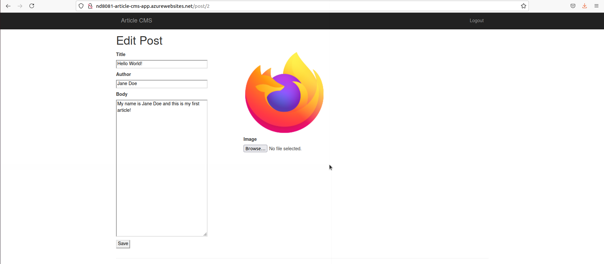

# Write-up 

---

### Analyze, choose, and justify the appropriate resource option for deploying the app.

<b>Virtual Machine</b>

- Cost:
    - VM is on average more expensive than app service.
- Scalability: 
    - VMs allow full access and control of the VM. So we are able to control the underlying OS or install software on the server.
    - Multiple types to choose from, such as compute or memory-optimized VMs, along with varying amounts of CPU, RAM and storage. The capacity of the performance of a VM instance can reach is higher than that of an App service instance.
- Availability:
    - Service level agreement (SLA) varies according to storage type of the VM. For single instance VM using
        -  Standard HDD Managed Disks for Operating System Disks and Data Disks, the guaranteed Virtual Machine Connectivity is of at least 95%.
        - Standard SSD Managed Disks for Operating System Disk and Data Disks, the guaranteed Virtual Machine Connectivity is of at least 99.5%.
        - Premium SSD or Ultra Disk for all Operating System Disks and Data Disks, the guaranteed Virtual Machine Connectivity is of at least 99.9%.
    - In essence, higher availability comes at higher pricing.
- Workflow simplicity:
    - It can be more time consuming for the developers than the app service options, as developers need to manage the OS and software installation tasks.

<b>App Service</b>

- Cost:
    - App service is on average cheaper than VM.
- Scalability:
    - Unable to control the underlying OS or install software on the server.
    - Vertical scaling increases or decreases resources allocated to our App Service, such as the amount of vCPUs or RAM, by changing the App Service pricing tier.
    - Horizontal scaling increases or decreases the number of Virtual Machine instances our App Service is running.
    - However, there are hardware limitations, such as a maximum of 14GB of memory and 4 vCPU cores per instance.
- Availability:
    - The service level agreement (SLA) gurantees that Apps running in a customer subscription will be available 99.95% of the time. 
- Workflow simplicity:
    - Developers don't have to take care of OS configuration or software installation. 
    - Applications can be deployed using continuous deployment model with GitHub, Azure DevOps, or any Git repo.

|Aspect|Virtual Machine | App Service|
|:-:|:-:|:-:|
|Cost (Cheaper)|&#9733;|&#9733;&#9733;&#9733;|
|Scalability|&#9733;&#9733;&#9733;|&#9733;|
|Availability|&#9733;|&#9733;&#9733;|
|Workflow (Simplicity)|&#9733;|&#9733;&#9733;&#9733;|

In summary, we will go for <b>App Service</b> for the deployment of Article CMS Apps. 

The main consideration is that the Article CMS apps is a lightweight service and we don't have the need for high performance compute.

Although it comes with a drawback than it might be less scalable than the VM option, however it is on average cheaper, with higher availability and simpler to deploy.

### Assess app changes that would change your decision.

There might be a need to switch to the VM option if the Article CMS app has Natural Language Processing feature, e.g. sentiment analysis, that requires higher performance compute like GPU or TPU.
 

 ---

 # Attachments

1. A screenshot of an article created in the Article CMS on Azure. The screenshot must also include the URL. 

    

2. A screenshot of the resource group from the Azure Portal including all of the resources that were created to complete this project. 
 
    

3. A screenshot showing the created tables and one query of data from the initial scripts in the SQL database.

    

4. A screenshot showing an example of blob endpoints for where images are sent for storage.

    

5. A screenshot of the redirect URIs related to Microsoft authentication.

    

6. A screenshot showing one potential form of logging with an "Invalid login attempt" and "admin logged in successfully", taken from the app's Log stream.

    

7. Important source files.

    - <a href='./FlaskWebProject/__init__.py'>\__init\__.py</a>
    - <a href='./FlaskWebProject/views.py'>views.py</a>

8. A URL to the Python App Service: <a href='https://nd8081-article-cms-app.azurewebsites.net'>link</a> 